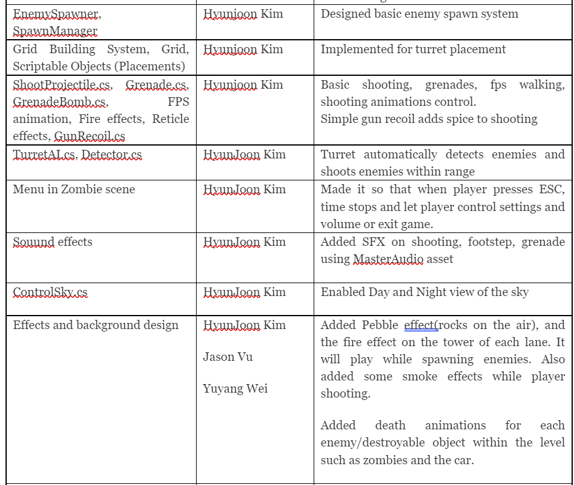

##Unity 3D Defense Shooter
3D Zombine defense shooting game where you’re a scientist that worked for the United States military, who has created a cryogenic sleep capsule. You wanted to have safety from the upcoming nuclear warfare, so you went into your capsule. However, during your sleep, radiation has engulfed the planet, so the plants and animals began to mutate. There are the same animals and plants that you know of but with a twist–some have grown extra limbs, gained increased size, and have a new distinct feature about them. 

### What I made in this game?
- Grid: 

[code link](https://github.com/LittleRookey/ZombieDefenseShooter/blob/main/Unity%20Project/Assets/LittleRookey/Grid/Grid.cs)

- Grid Building system 

[code link](https://github.com/LittleRookey/ZombieDefenseShooter/blob/main/Unity%20Project/Assets/LittleRookey/Grid/GridBuildingSystem.cs)

- Placed Objects(Scriptable Object that can be placed on grid) 
[code link](https://github.com/LittleRookey/ZombieDefenseShooter/blob/main/Unity%20Project/Assets/LittleRookey/Grid/ScriptableObject/PlacedObjects.cs)

- My Contribution

## Trailer
https://www.youtube.com/watch?v=ytfo9PKWcS8&t=1s

## Youtube link(Code walkthrough)
https://www.youtube.com/watch?v=4iNlGqzPhMs&t=183s

## Contributors
HyunJoon Kim

Jason Vu

Spencer Mullen

Yuyang Wei 

## Reference
CodeMonkey's grid building system tutorial

